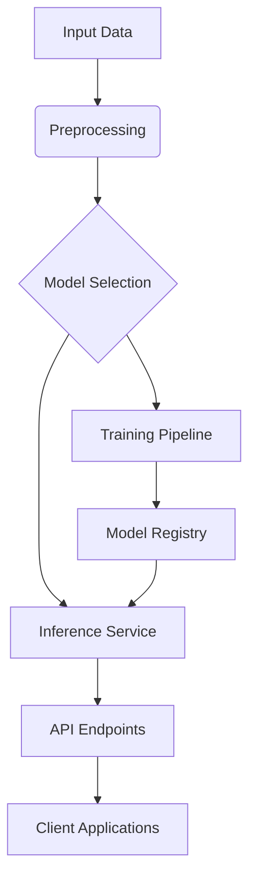

# AI Core Architecture Overview

## System Architecture


## Key Components
1. **Model Registry** (`src/ai/core/model-registry.ts`)
   - Version control for ML models
   - Metadata tracking
   - Lifecycle management

2. **Training Pipeline** (`src/ai/pipelines/training-pipeline.ts`):
```typescript
interface TrainingPipelineConfig {
  dataSource: string;
  modelArchitecture: 'transformer' | 'cnn' | 'rnn';
  hyperparameters: Record<string, number>;
  hardwareAcceleration: 'cuda' | 'cpu';
}

function createPipeline(config: TrainingPipelineConfig): Pipeline {
  // Implementation details
}
```

3. **Inference Service** (`src/ai/services/inference-service.ts`):
   - Low-latency model serving
   - Auto-scaling based on demand
   - Model version A/B testing

## Design Principles
1. Modular component architecture
2. Reproducible training workflows
3. Horizontal scaling for inference
4. Unified model format (ONNX)

[Next: Engine Configuration →](../engine-guide.md)