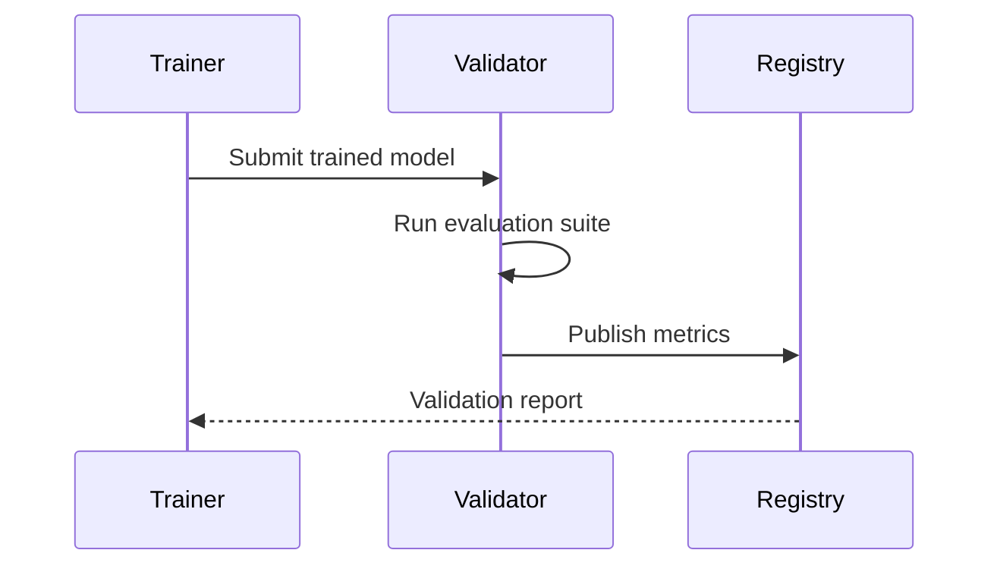

# Advanced Training Workflows

## Distributed Training Configuration
```python
from ai.distributed import TrainingCluster

cluster = TrainingCluster(
    nodes=4,
    gpus_per_node=4,
    strategy="ddp",
    precision="bf16"
)

cluster.run(
    train_script="src/ai/train.py",
    config="configs/vision_transformer.yaml"
)
```

## Model Validation Pipeline


## Hardware Optimization
```yaml
# config/hardware/accelerator.yaml
cuda:
  memory_limit: 32GB
  kernel_cache: true
tpu:
  topology: v4-8
  bfloat16: true
cpu:
  thread_pinning: true
  avx512: true
```

[Next: Deep Learning Models →](../../models/deep-learning-guide.md)