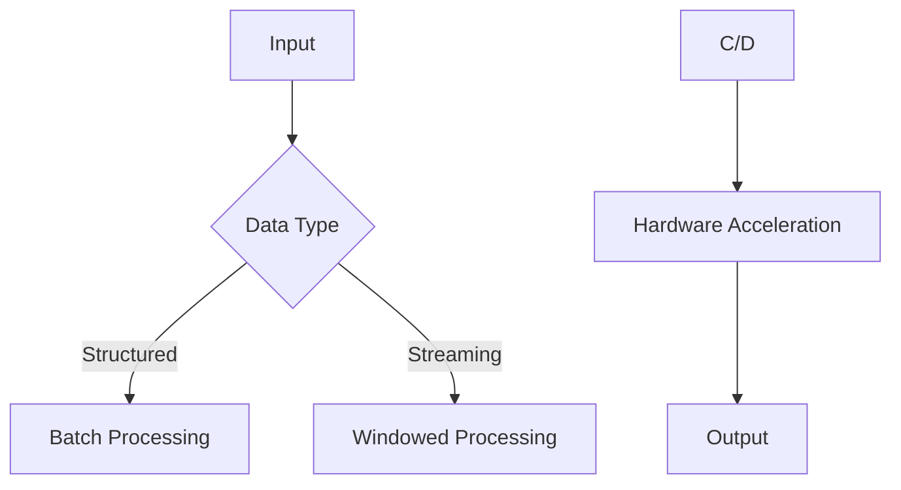

# AI Implementation Best Practices

## Design Patterns
```typescript
// Factory pattern for model initialization
interface ModelFactory {
  createModel(config: ModelConfig): Promise<Model>;
}

class TransformerFactory implements ModelFactory {
  async createModel(config: ModelConfig) {
    return await loadPretrained(config.modelName);
  }
}
```

## Performance Optimization


## Security Guidelines
1. Model Signing:
```bash
openssl dgst -sha256 -sign private.pem -out model.sha256 model.onnx
```
2. Input Validation:
```python
from ai.security import validate_input

safe_input = validate_input(
    user_input,
    max_length=1024,
    allowed_chars=r'[a-zA-Z0-9.,!? ]'
)
```

[View Troubleshooting Guide →](../troubleshooting.md)