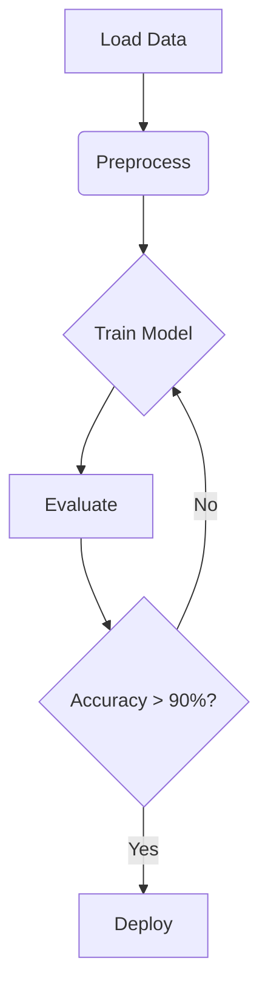

# AI Integration Quickstart

## Prerequisites
```bash
# Install core dependencies
pip install ai-core sdk

# Verify installation
ai-core check-environment
```

## Basic Usage
```python
from ai_core import Pipeline

pipeline = Pipeline.load("configs/text-classification.yaml")
results = pipeline.run("Sample input text")
print(results.predictions)
```

## Example Workflow


[Explore Best Practices →](../best-practices.md)