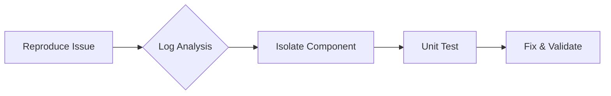

# AI System Troubleshooting

## Common Issues
```yaml
# Error pattern configuration
error_patterns:
  - name: "OOM_ERROR"
    detection: "CUDA out of memory"
    solution: "Reduce batch size or enable mixed precision"
  - name: "INPUT_SHAPE_MISMATCH"
    detection: "Expected input shape"
    solution: "Verify preprocessing pipeline"
```

## Debugging Workflow


## Performance Diagnostics
```bash
# Run system profiler
ai-diag profile --duration 60 --output profile.json

# Analyze results
ai-diag analyze profile.json --report-format html
```

[Back to Best Practices →](../best-practices.md)