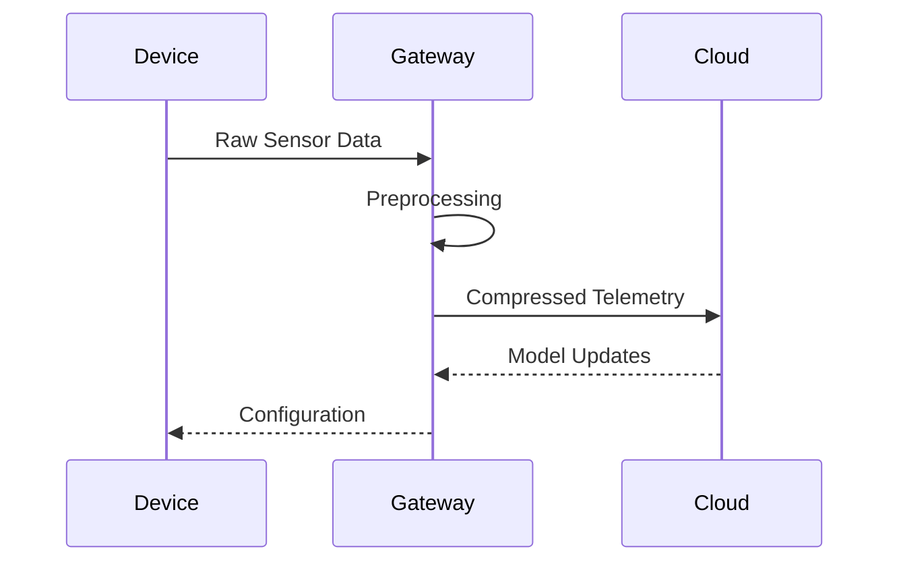

# System Integration Connectors

## Cloud Deployment
```yaml
# config/integration/aws.yaml
resources:
  s3:
    modelsBucket: "ai-models-prod"
    dataBucket: "training-data"
  ecs:
    cluster: "ai-inference"
    taskDefinition: "gpu-optimized"
  lambda:
    preprocessingFunction: "image-resizer"
```

## Edge Device Setup
```typescript
import { EdgeManager } from '../../src/integration/edge';

const edge = new EdgeManager({
  deviceType: 'jetson-xavier',
  model: 'efficientnet-lite',
  telemetryInterval: 5000
});

edge.deployModel('models/edge-detection.onnx');
```

## Protocol Handling


[Next: Adapter Patterns →](../adapters-guide.md)