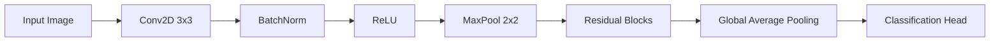

# Deep Learning Implementation Guide

## Transformer Architecture
```python
from ai.models.transformers import VisionTransformer

vit = VisionTransformer(
    image_size=224,
    patch_size=16,
    num_layers=12,
    hidden_dim=768,
    num_heads=12,
    mlp_dim=3072
)
```

## CNN Feature Extraction


## Model Selection Matrix
| Use Case          | Architecture   | Pretrained Weights |
|-------------------|----------------|--------------------|
| Image Recognition | EfficientNet-B7| ImageNet-21k       |
| Text Generation   | GPT-3          | WebText            |
| Time Series       | Temporal CNN   | None               |
| Multimodal        | CLIP           | LAION-400M         |

[Explore Specialized Models →](../specialized-guide.md)