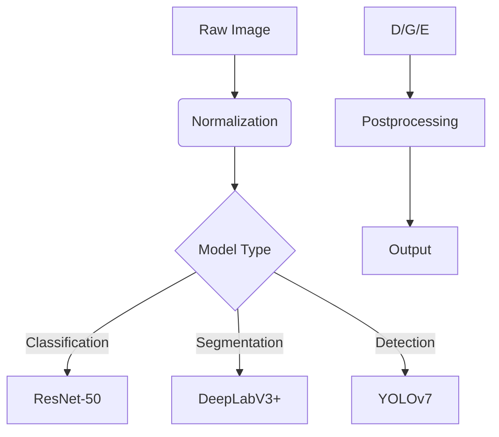

# Specialized Model Implementations

## NLP Pipeline
```typescript
import { NLPProcessor } from '../../src/ai/nlp/processor';

const processor = new NLPProcessor({
  model: 'bert-base-uncased',
  tokenizer: 'wordpiece',
  maxLength: 512
});

const entities = processor.extractEntities(
  "Apple Inc. announced quarterly earnings of $90B"
);
```

## Vision Processing


## Custom Model Integration
```python
from ai.integration import ModelAdapter

class CustomModelAdapter(ModelAdapter):
    def preprocess(self, input):
        return normalize(input)
    
    def postprocess(self, output):
        return denormalize(output)

adapter = CustomModelAdapter(
    model_path="models/custom-model.onnx",
    accelerator="cuda"
)
```

[Next: Inference Services →](../../services/inference-guide.md)