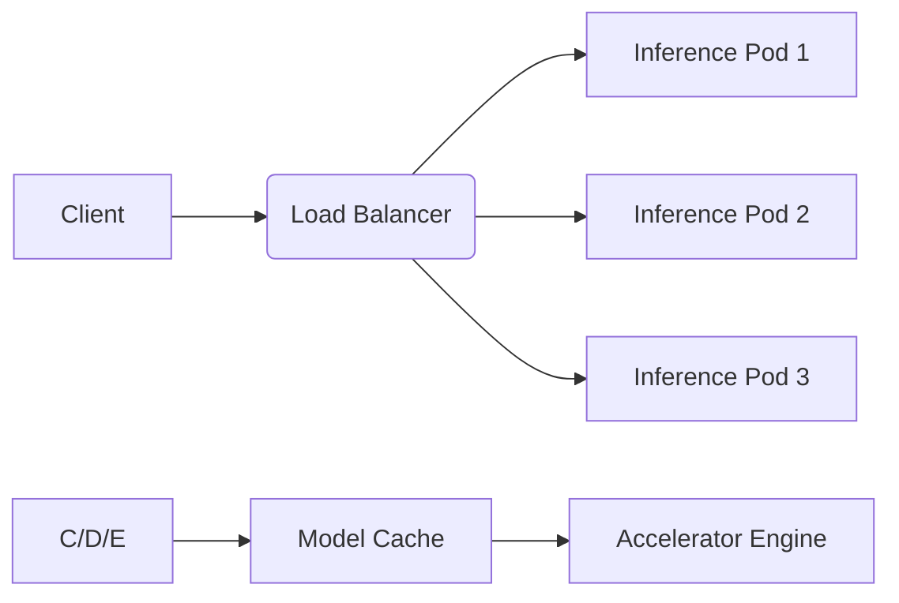

# AI Inference Service Guide

## Deployment Configuration
```yaml
# config/inference/production.yaml
services:
  - name: "image-classifier"
    model: "efficientnet-b4"
    replicas: 3
    resources:
      gpu: 1
      memory: "16Gi"
    autoscaling:
      min_replicas: 2
      max_replicas: 10
      target_utilization: 75%
```

## Stream Processing
```typescript
import { InferenceStream } from '../../src/ai/services/inference-stream';

const stream = new InferenceStream({
  model: 'bert-qa',
  windowSize: 512,
  batchTimeout: 100
});

stream.process(inputText)
  .on('data', (results) => {
    // Handle real-time predictions
  });
```

## Performance Optimization


[Next: Optimization Strategies →](../optimization-guide.md)