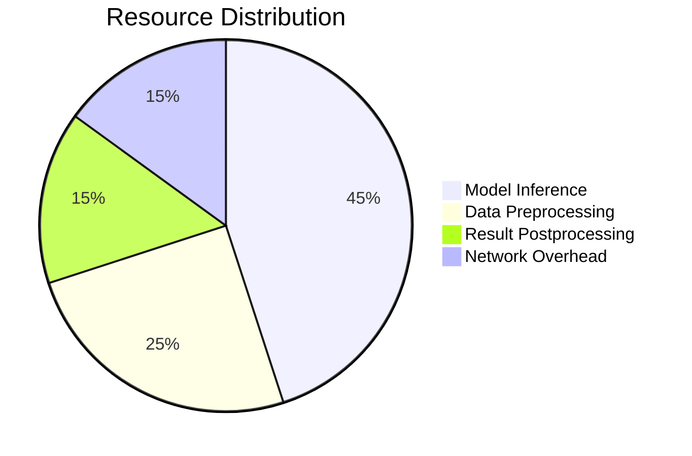

# AI Optimization Strategies

## Hardware Configuration
```yaml
# config/hardware/accelerators.yaml
cuda:
  mixed_precision: true
  memory_optimization: "aggressive"
tpu:
  bfloat16: true
  topology: "v4-16"
cpu:
  thread_affinity: true
  avx512: enabled
```

## Model Quantization
```python
from ai.optimization import ModelQuantizer

quantizer = ModelQuantizer(
    model="models/resnet50.onnx",
    calibration_data="data/calibration/",
    precision="int8"
)

quantized_model = quantizer.optimize()
```

## Performance Profiling
```bash
ai-profiler analyze --model efficientnet-b3 \
                   --batch-sizes 32,64,128 \
                   --precision fp16,fp32 \
                   --output report.html
```

## Resource Allocation


[Next: Integration Patterns →](../../integration/connectors-guide.md)