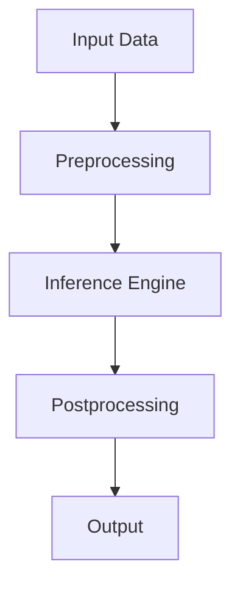

# AI Core Overview

## Architecture
The AI Core consists of these main components:
- **Inference Engine**: Handles model execution and prediction
- **Model Manager**: Manages model loading/unloading
- **Pipeline Controller**: Orchestrates data flow between components
- **Resource Monitor**: Tracks GPU/CPU/memory usage

## Performance Characteristics
| Component | Throughput | Latency | Memory Usage |
|-----------|------------|---------|--------------|
| Inference | 1000 req/s | 50ms | 2GB |
| Training | 100 req/s | 500ms | 8GB |

## Resource Requirements
- Minimum: 4GB RAM, 2 CPU cores
- Recommended: 16GB RAM, GPU with 8GB VRAM