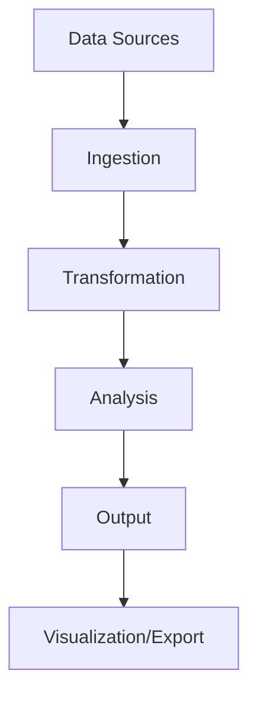

# Analytics Pipeline Overview

## Architecture
The analytics pipeline follows a modular, event-driven architecture with these key components:

1. **Data Sources** - Ingests data from databases, APIs, and streams
2. **Processing Engine** - Handles stream/batch processing with stages:
   - Ingestion
   - Transformation  
   - Analysis
   - Output generation
3. **Coordination Layer** - Manages pipeline state and resource allocation

## Component Relationships
- **Pipeline Manager**: Orchestrates stage execution
- **Stage Handlers**: Process data in isolated units
- **Resource Coordinator**: Balances workload across workers
- **Metrics Collector**: Tracks pipeline performance

## Performance Characteristics
| Aspect | Batch Mode | Stream Mode |
|--------|------------|-------------|
| Latency | High (seconds+) | Low (milliseconds) |
| Throughput | High | Medium |
| Resource Use | High during bursts | Consistent |
| Use Cases | Historical analysis | Real-time monitoring |