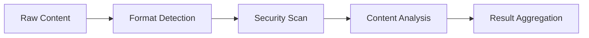

# Clipboard Service Design Patterns

## Event-Driven Architecture
```typescript
// Example event subscription
clipboard.on('update', (content) => {
  pipeline.process(content);
});
```

Key characteristics:
- Decoupled components
- Asynchronous processing
- Observable state changes

## Processing Pipeline


## Error Handling Patterns
1. **Retry Pattern**: For transient clipboard access errors
2. **Circuit Breaker**: For repeated failures
3. **Dead Letter Queue**: For unprocessable content

## Resource Management
- Memory-bound processing queues
- Worker pool for CPU-intensive tasks
- Automatic cleanup of stale resources