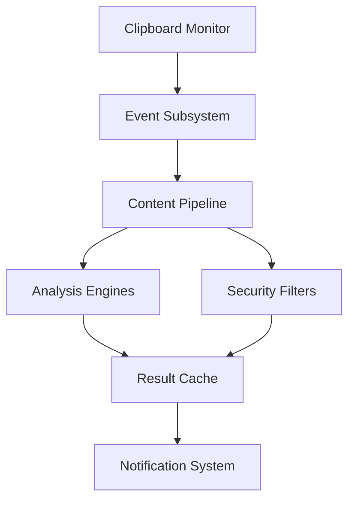

# Clipboard Monitor Service Overview

## Architecture Overview
The Clipboard Monitor Service is an event-driven system that:
- Monitors system clipboard changes
- Processes content through analysis pipelines
- Manages secure IPC communication
- Provides extensible filtering capabilities



## Component Relationships
- **Monitor Core**: Handles low-level clipboard events
- **Processing Pipeline**: Chains analyzers and filters
- **IPC Bridge**: Manages secure cross-process communication
- **Service Manager**: Controls lifecycle and resources

## Security Considerations
1. Content sanitization for all clipboard inputs
2. Process isolation for untrusted content
3. Memory limits for large clipboard items
4. Secure IPC channels with message validation

## Installation Requirements
```bash
# Minimum system requirements
Node.js 18+
Electron 25+
System clipboard access permissions