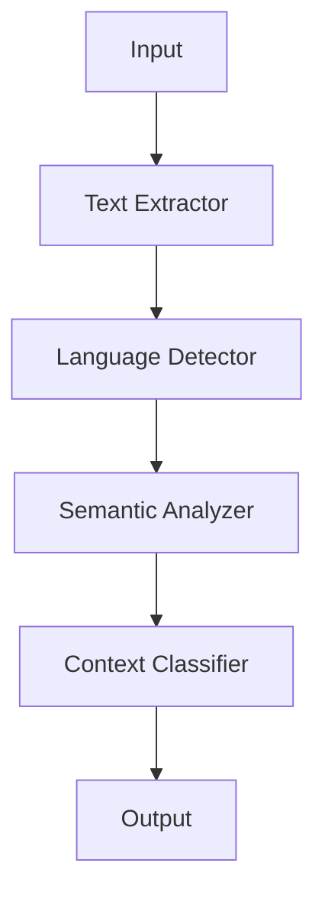

# Content Analyzers

## Analysis Pipeline

## Format Detection
Supported content types:
1. Plain text
2. HTML/RTF
3. Images (OCR capability)
4. Custom application formats

## Size Management
- **Small**: <1MB (immediate processing)
- **Medium**: 1-10MB (background processing)
- **Large**: >10MB (requires user confirmation)

## Performance Tips
1. Cache frequent analysis results
2. Use incremental processing
3. Prioritize visible content
4. Throttle background analysis