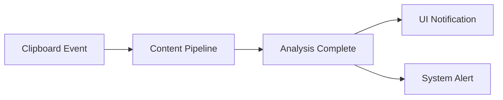

# Service Communication Architecture

## IPC Architecture
```typescript
interface IPCMessage {
  channel: 'clipboard' | 'security' | 'status';
  payload: unknown;
  timestamp: number;
}
```

## Event Bridging
1. Clipboard → Main Process → Renderer
2. System Events → Service Workers
3. Cross-application notifications

## Notification System


## Security Measures
1. Message validation
2. Rate limiting
3. Content sanitization
4. Process isolation