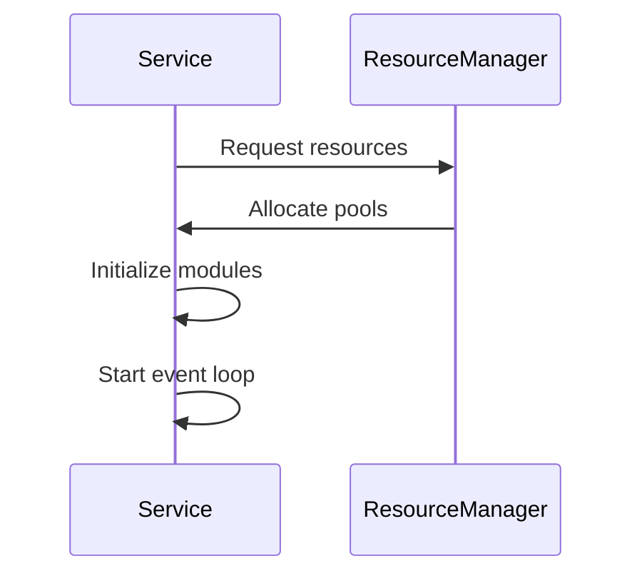

# Service Lifecycle Management

## Initialization Sequence
1. **Dependency Check**: Verify system requirements
2. **Resource Allocation**: Setup memory pools and workers
3. **Event Registration**: Subscribe to system events
4. **Security Setup**: Initialize sandboxing

## State Management
- **Active**: Processing clipboard events
- **Paused**: Temporarily suspended
- **Error**: Recoverable failure state
- **Terminated**: Shutdown complete

## Cleanup Procedures
1. Release system handles
2. Flush pending operations
3. Persist state if needed
4. Notify dependent services