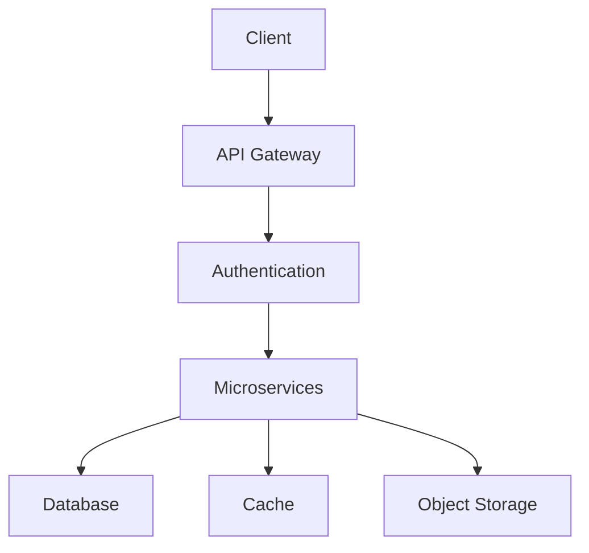

# Cloud Core Architecture

## Overview



## Key Components
- **API Gateway**: Entry point for all requests (see `src/cloud/core/api-gateway.ts`)
- **Service Mesh**: Inter-service communication layer
- **Event Bus**: Real-time event streaming (Kafka implementation in `src/cloud/utils/event-bus.ts`)

## Design Principles
```ts
// Example: Circuit Breaker Pattern
import { CircuitBreaker } from '@cloud/core';

const service = new CircuitBreaker({
  timeout: 3000,
  fallback: () => cachedResponse,
});
```

## Best Practices
1. Implement auto-scaling policies
2. Use immutable infrastructure
3. Enable comprehensive monitoring