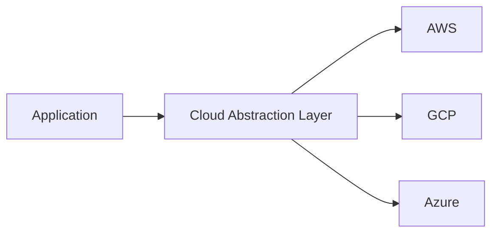

# Cloud Platform Management

## Provider Abstraction Layer
```ts
// From src/cloud/core/provider-abstraction.ts
interface CloudProvider {
  name: 'AWS' | 'GCP' | 'Azure';
  regions: string[];
  authenticate(config: object): void;
}
```

## Region Configuration
```yaml
# Example from src/cloud/config/regions.yaml
primary_region: us-west-2
fallback_regions:
  - eu-central-1
  - ap-northeast-1
```

## Multi-Cloud Architecture



## Deployment Patterns
1. Blue/Green deployments (see `src/cloud/utils/deployment-strategies.ts`)
2. Canary releases
3. Geo-sharding for global applications