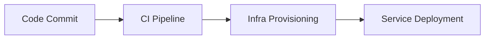

# Cloud Platform Getting Started

## Prerequisites
```bash
# From project root
npm install
cp .env.example .env
```

## Initial Configuration
```ts
// src/cloud/core/config.ts
interface CloudConfig {
  provider: 'aws' | 'gcp' | 'azure';
  region: string;
  credentials: {
    accessKey: string;
    secret: string;
  };
}
```

## Deployment Workflow



## Common Patterns
1. Use infrastructure-as-code (see `src/cloud/templates/`)
2. Implement monitoring from day one
3. Follow least-privilege security principles