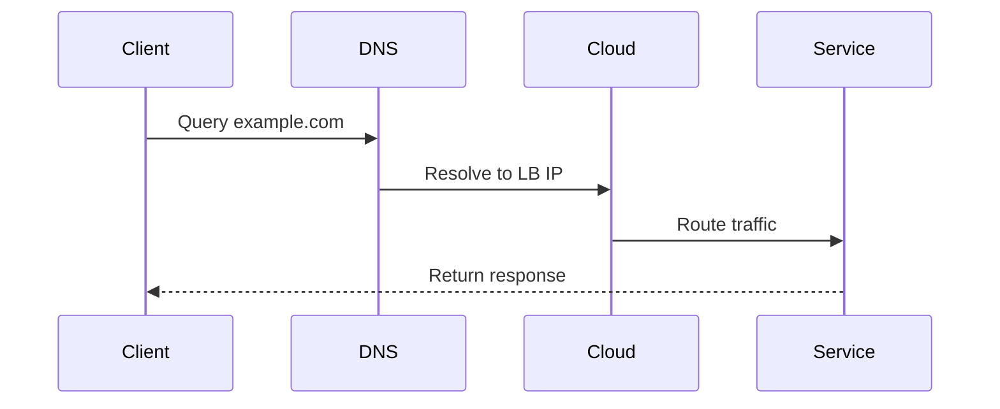

# Cloud Networking Configuration

## Virtual Network Setup
```ts
// From src/cloud/integration/network-manager.ts
interface VPCConfig {
  cidrBlock: string;
  subnets: {
    public: string[];
    private: string[];
  };
}
```

## Load Balancing Implementation
```yaml
# Example from src/cloud/config/loadbalancer.yaml
load_balancer:
  type: application
  listeners:
    - protocol: HTTP
      port: 80
  health_check:
    path: /health
    interval: 30
```

## DNS Management Flow



## Security Patterns
1. Implement network ACLs (reference `src/security/network/acl-manager.ts`)
2. Use private subnets for databases
3. Enable VPC flow logging