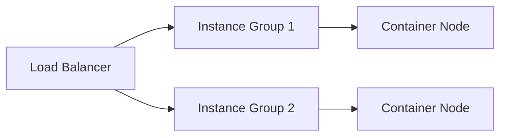

# Cloud Compute Management

## Instance Types
```ts
// From src/cloud/services/compute-manager.ts
enum InstanceType {
  GeneralPurpose = 't3.micro',
  ComputeOptimized = 'c5.large',
  MemoryOptimized = 'r5.xlarge'
}
```

## Auto-Scaling Configuration
```yaml
# Example from src/cloud/config/autoscale.yaml
autoscale:
  min_instances: 2
  max_instances: 10
  cpu_threshold: 75
  cooldown_period: 300
```

## Cluster Operations



## Best Practices
1. Use spot instances for batch processing
2. Implement health checks (see `src/cloud/utils/health-monitor.ts`)
3. Enable instance recycling