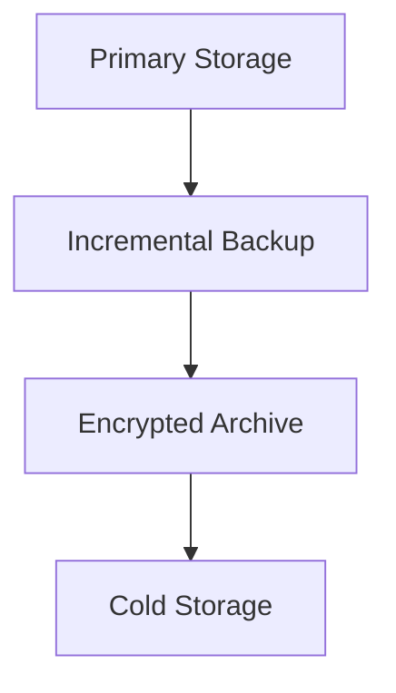

# Cloud Storage Management

## Storage Types
```ts
// From src/cloud/services/storage-manager.ts
interface StorageConfig {
  type: 'block' | 'object' | 'file';
  replication: number;
  encryption: boolean;
}
```

## Data Replication Setup
```yaml
# Example from src/cloud/config/storage.yaml
replication:
  strategy: cross-region
  regions: [us-east-1, eu-west-1]
  sync_interval: 300
```

## Backup Strategy



## Performance Patterns
1. Use CDN for static assets
2. Implement tiered storage (reference `src/cloud/utils/storage-tiers.ts`)
3. Enable versioning for critical data