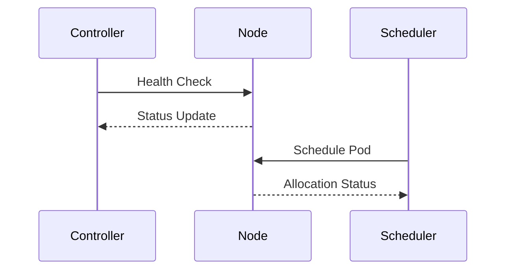

# Container Orchestration Fundamentals

## Cluster Management
```typescript
// From src/scaling/distributed/coordination/node-coordinator.ts
interface ClusterConfig {
  nodes: NodeSpec[];
  autoScaling: {
    minNodes: number;
    maxNodes: number;
    metrics: ScalingMetric[];
  };
  networking: NetworkPolicy;
}

class NodeCoordinator {
  registerNode(node: NodeSpec): void {
    // Implementation matches architecture overview
  }
}
```

## Node Lifecycle


[See scheduling strategies](./scheduling-guide.md) for resource allocation details.