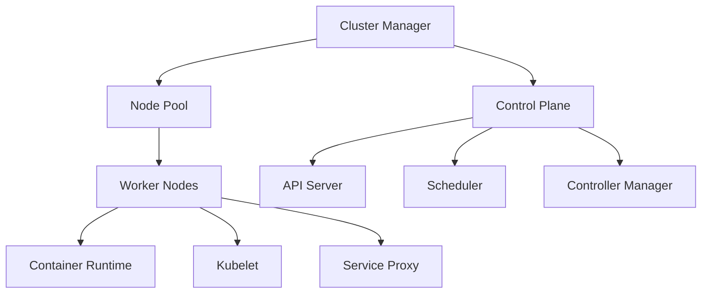

# Container Orchestration Architecture

## Core Components


## Design Principles
1. Declarative configuration
2. Self-healing systems
3. Horizontal scaling
4. Service discovery integration

## Implementation Example
```typescript
// From src/scaling/resources/allocation/resource-allocator.ts
interface ResourceRequest {
  cpu: string;
  memory: string;
  ephemeralStorage?: string;
}

class ResourceAllocator {
  allocatePodResources(podSpec: PodSpec): AllocationResult {
    // Implementation matches scheduling-guide.md requirements
  }
}