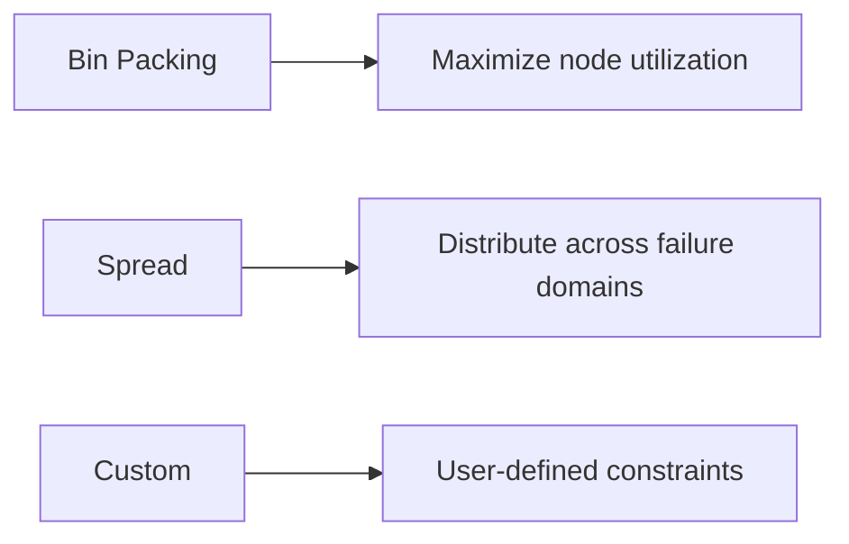

# Container Scheduling Strategies

## Allocation Policies


## Resource Configuration
```yaml
# Example from src/scaling/performance/auto-scaling/scale-manager.ts
resources:
  limits:
    cpu: "2"
    memory: "4Gi"
  requests:
    cpu: "1"
    memory: "2Gi"
```

## Placement Constraints
```typescript
// From src/scaling/resources/allocation/resource-allocator.ts
interface PlacementConstraint {
  nodeSelector?: Map<string, string>;
  affinity?: AffinityRules;
  tolerations?: Toleration[];
}
```

[See architecture overview](../core/overview.md) for component relationships.