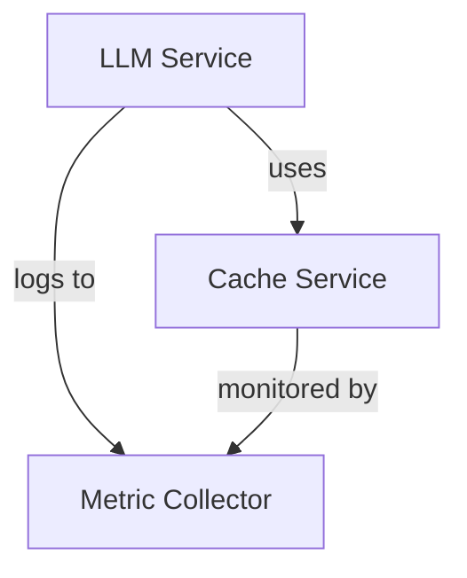

# Deployment Architecture Overview

## System Components
- **Core Services**:
  - [`src/main/services/llm-service.ts`](src/main/services/llm-service.ts): Main LLM integration service
  - [`src/main/services/cache-service.ts`](src/main/services/cache-service.ts): Caching layer
  - [`src/monitoring/core/collectors/metric-collector.ts`](src/monitoring/core/collectors/metric-collector.ts): Metrics collection

## Component Relationships

## Security Considerations
- All external calls use [`src/shared/utils/llm-security.ts`](src/shared/utils/llm-security.ts) for sanitization
- Rate limiting via [`src/shared/utils/rate-limiter.ts`](src/shared/utils/rate-limiter.ts)

## Best Practices
1. Always deploy with monitoring enabled
2. Use blue-green deployment strategy
3. Validate configurations using [`src/main/services/config-manager.ts`](src/main/services/config-manager.ts)