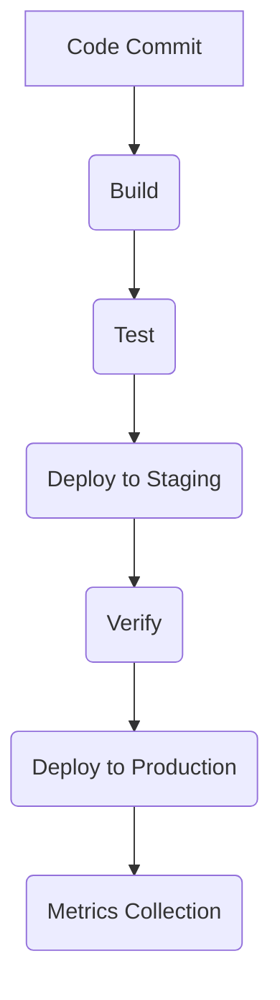

# Deployment Architecture Overview

## Core Components

1. **Deployment Engine**
   - Central orchestration service
   - Manages deployment workflows
   - Coordinates between components

2. **Pipeline Manager**
   - Defines and executes deployment pipelines
   - Handles stage transitions
   - Manages rollback procedures

3. **Environment Controller**
   - Provisions target environments
   - Manages resource allocation
   - Handles configuration management

## Workflow Diagram

## Design Principles

1. **Immutable Infrastructure**
   - Environments are disposable
   - No in-place updates
   - Version-controlled configurations

2. **Declarative Configuration**
   - Infrastructure as Code
   - Version-controlled definitions
   - Reproducible environments

3. **Progressive Rollout**
   - Canary deployments
   - Blue-green switching
   - Feature flags

[See Engine Guide](./engine-guide.md) for implementation details.