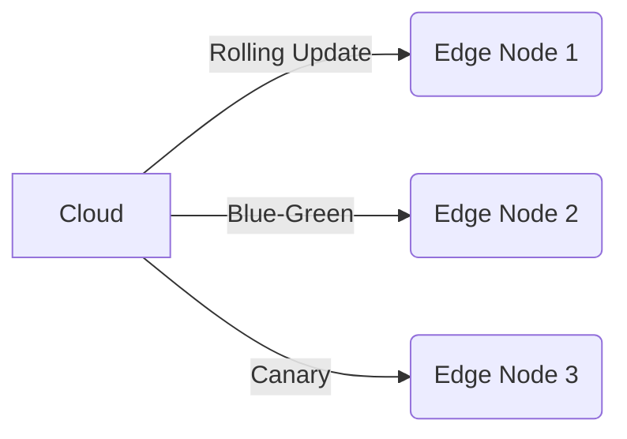

# Edge Deployment Strategies

## Deployment Patterns


## Configuration Management
```ts
// From [config-manager.ts](src/main/services/config-manager.ts)
interface DeploymentConfig {
  version: string;
  rollbackThreshold: number;
  healthCheckInterval: number;
  maxParallelDeploys: number;
}
```

## State Synchronization
```ts
// Example from [state-sync.ts](src/scaling/distributed/coordination/state-sync.ts)
const syncService = new StateSyncService({
  conflictResolver: 'last-write-wins',
  syncInterval: 5000,
  maxRetries: 3
});
```

## Operational Best Practices
1. Use [health-monitor.ts](src/realtime/services/monitoring/health-monitor.ts) for deployment validation
2. Implement circuit breakers using [threshold-monitor.ts](src/scaling/load/monitoring/threshold-monitor.ts)
3. Follow incremental update patterns from [state-sync.ts](src/scaling/distributed/coordination/state-sync.ts)

[Next: Compute Services →](../services/compute-guide.md)