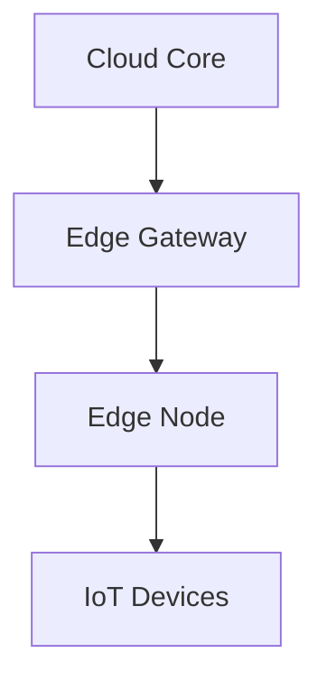

# Edge Core Architecture

## System Overview



## Key Components
1. **Edge Runtime** - Lightweight execution environment ([realtime-engine.ts](src/realtime/core/engine/realtime-engine.ts))
2. **Resource Manager** - Hardware abstraction layer ([resource-allocator.ts](src/scaling/resources/allocation/resource-allocator.ts))
3. **Data Pipeline** - Stream processing framework ([pipeline-manager.ts](src/realtime/core/pipeline/pipeline-manager.ts))

## Design Principles
```ts
// Example: Edge Configuration from resource-allocator.ts
interface EdgeConfig {
  maxMemoryMB: number;
  cpuCores: number;
  networkQuota: NetworkProfile;
}
```

## Best Practices
- Use circuit breakers for cloud communication
- Implement local cache-first strategies
- Apply incremental updates via [state-sync.ts](src/scaling/distributed/coordination/state-sync.ts)