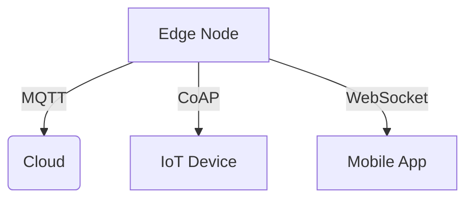

# Edge Communication Protocols

## Message Handling
```ts
// From [event-coordinator.ts](src/realtime/services/coordination/event-coordinator.ts)
interface EdgeMessage {
  headers: Map<string, string>;
  payload: ArrayBuffer;
  priority: MessagePriority;
  ttl: number;
}
```

## Network Management


## Protocol Patterns
```ts
// Example from [stream-controller.ts](src/realtime/streams/management/stream-controller.ts)
const protocolConfig = {
  retryStrategy: 'exponential-backoff',
  compression: 'gzip',
  heartbeatInterval: 30000
};
```

[Next: Security Configuration →](../integration/security-guide.md)