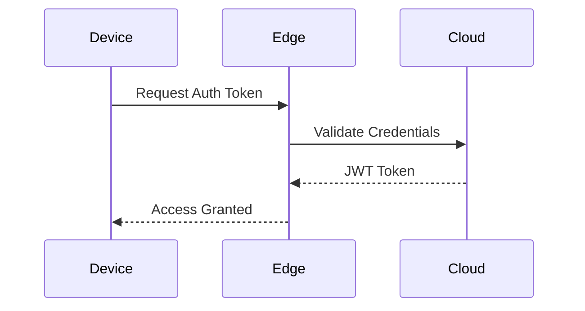

# Edge Security Configuration

## Authentication Flow


## Encryption Setup
```ts
// From [encryption-service.ts](src/security/features/encryption/encryption-service.ts)
const edgeCipher = new EdgeCipher({
  algorithm: 'AES-GCM',
  keyDerivation: 'PBKDF2',
  iterations: 100000
});
```

## Policy Enforcement
```ts
// Example from [policy-enforcer.ts](src/security/core/authorization/policy-enforcer.ts)
const accessPolicy = {
  resource: '/api/sensors',
  actions: ['read'],
  conditions: [
    { type: 'time', range: '08:00-18:00' },
    { type: 'device', trustLevel: 'high' }
  ]
};
```

## Security Patterns
| Pattern              | Implementation File                          | Use Case                |
|----------------------|----------------------------------------------|-------------------------|
| Zero-Trust           | [auth-service.ts](src/security/core/authentication/auth-service.ts) | Device authentication   |
| CRL Validation       | [certificate-manager.ts](src/security/features/encryption/certificate-manager.ts) | Certificate management  |
| Rate Limiting        | [rate-limiter.ts](src/security/protection/prevention/rate-limiter.ts) | DDoS protection         |

[Next: Monitoring Tools →](../utils/monitoring-guide.md)