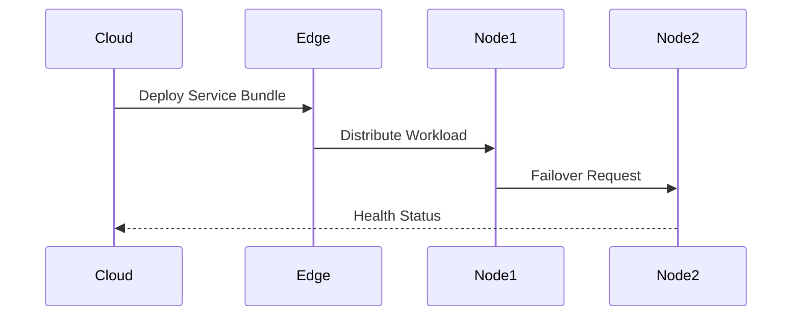

# Edge Compute Services

## Task Scheduling
```ts
// From [worker-scheduler.ts](src/scaling/distributed/workers/worker-scheduler.ts)
interface TaskSchedule {
  priority: number;
  timeout: number;
  retryPolicy: RetryStrategy;
  resourceRequirements: ComputeResources;
}
```

## Service Orchestration


## Resource Allocation
```ts
// Example from [resource-allocator.ts](src/scaling/resources/allocation/resource-allocator.ts)
const allocation = new ResourceAllocator({
  cpu: { min: 1, max: 4 },
  memory: { min: 512, max: 4096 },
  network: { bandwidth: '100Mbps' }
});
```

[Next: Data Management →](../services/data-guide.md)