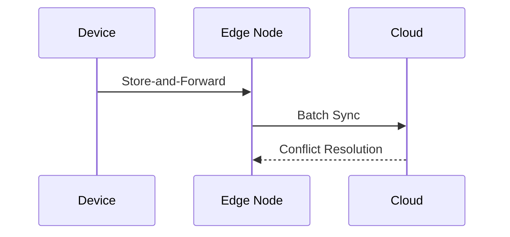

# Edge Data Management

## Synchronization Patterns
```ts
// From [sync-service.ts](src/realtime/services/coordination/sync-service.ts)
enum SyncMode {
  EVENTUAL_CONSISTENCY,
  STRONG_CONSISTENCY,
  CRDT_BASED
}
```

## Caching Strategies
```ts
// Example from [cache-service.spec.ts](src/main/services/__tests__/cache-service.spec.ts)
const cache = new EdgeCache({
  strategy: 'LFU',
  maxSizeMB: 1024,
  ttlSeconds: 3600
});
```

## Offline Operations


[Next: Communication Protocols →](../integration/communication-guide.md)