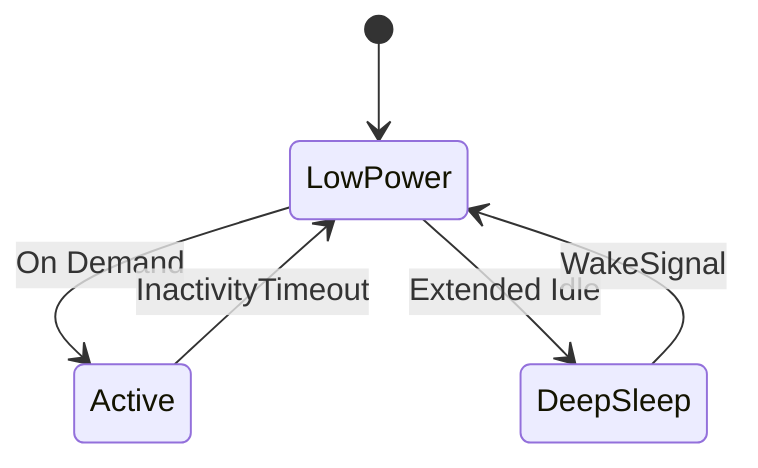

# Edge Optimization Techniques

## Resource Tuning
```ts
// From [resource-optimizer.ts](src/scaling/resources/optimization/resource-optimizer.ts)
const optimizationProfile = {
  cpuThrottleThreshold: 0.75,
  memoryReclaimPercentage: 0.25,
  networkBatchSize: 1024
};
```

## Power Management


## Efficiency Patterns
```ts
// Example from [performance-optimizer.ts](src/realtime/services/monitoring/performance-monitor.ts)
const optimizer = new PerformanceOptimizer({
  samplingInterval: 2000,
  adjustmentFactor: 0.1,
  maxAdjustments: 5
});
```

## Optimization Strategies
| Strategy          | Implementation File                          | Use Case                |
|-------------------|----------------------------------------------|-------------------------|
| Dynamic Batching  | [buffer-manager.ts](src/realtime/core/pipeline/buffer-manager.ts) | Data processing         |
| Connection Pooling| [stream-controller.ts](src/realtime/streams/management/stream-controller.ts) | Network optimization    |
| Cache Warming     | [cache-service.spec.ts](src/main/services/__tests__/cache-service.spec.ts) | Cold start improvement  |

[Next: Getting Started →](../guides/getting-started.md)