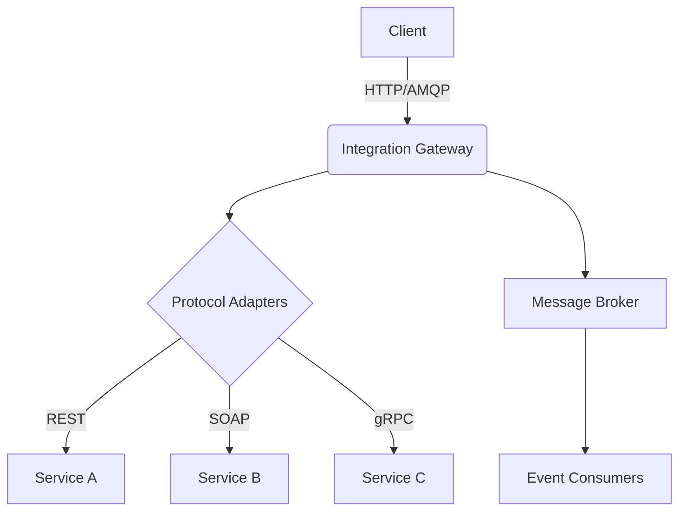

# Enterprise Integration Architecture Overview

## Core Components
- **Integration Gateway**: Central entry point for all integration traffic
- **Service Registry**: Dynamic catalog of available services
- **Protocol Adapters**: Handles protocol translation (REST, SOAP, gRPC, etc.)
- **Message Broker**: Event distribution backbone

## Security Model
- **Authentication**: JWT/OAuth2 with centralized identity provider
- **Authorization**: Role-based access control (RBAC)
- **Encryption**: TLS 1.3 for transport, AES-256 for data at rest
- **Audit**: Comprehensive logging of all integration activities

## Integration Patterns
1. **Point-to-Point**: Direct service-to-service communication
2. **Publish-Subscribe**: Event-driven architecture
3. **Request-Reply**: Synchronous request processing
4. **Batch Processing**: Scheduled data integration