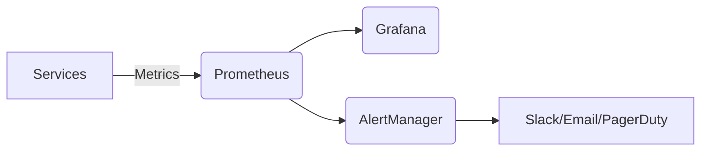

# Enterprise Integration Monitoring Guide

## Service Monitoring
```yaml
# Prometheus configuration example
scrape_configs:
  - job_name: 'integration-gateway'
    metrics_path: '/actuator/prometheus'
    static_configs:
      - targets: ['gateway:8080']
    relabel_configs:
      - source_labels: [__address__]
        target_label: instance
        regex: '([^:]+)(?::\d+)?'
        replacement: '$1'
```

### Key Metrics to Track
1. **Throughput**: Messages/requests per second
2. **Latency**: P95/P99 response times
3. **Error Rates**: 4xx/5xx percentages
4. **Queue Depths**: Backlog in message queues
5. **Resource Usage**: CPU, memory, network

## Health Checking
```json
// Health check response example
{
  "status": "UP",
  "components": {
    "db": { "status": "UP" },
    "diskSpace": { 
      "status": "UP",
      "details": { "free": 250GB, "threshold": 10GB }
    }
  }
}
```

## Metrics Collection Architecture


## Alert Configuration
```yaml
# Alert rule example
groups:
- name: integration-alerts
  rules:
  - alert: HighErrorRate
    expr: rate(http_requests_total{status=~"5.."}[5m]) > 0.1
    for: 10m
    labels:
      severity: critical
    annotations:
      summary: "High error rate on {{ $labels.instance }}"
      description: "5xx error rate is {{ $value }}"