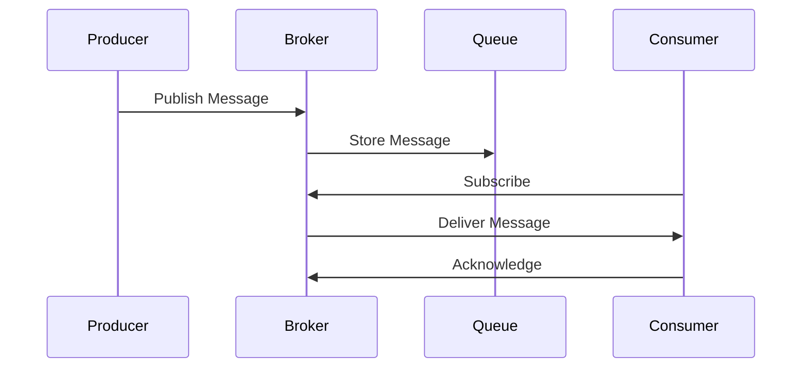

# Enterprise Messaging Brokers Guide

## Message Handling Patterns


### Configuration Examples
```yaml
# RabbitMQ configuration
rabbitmq:
  host: broker.company.com
  port: 5672
  virtualHost: /prod
  username: service-user
  password: ${BROKER_PASSWORD}
  queue:
    durable: true
    autoDelete: false
```

## Event Distribution
1. **Publish-Subscribe**:
   - Topics and exchanges
   - Fanout patterns
   - Selective consumers

2. **Point-to-Point**:
   - Work queues
   - Competing consumers
   - Message grouping

## Queue Management
| Operation | Command | Description |
|-----------|---------|-------------|
| Create | `queue.declare` | Establish new queue |
| Purge | `queue.purge` | Remove all messages |
| Delete | `queue.delete` | Remove queue |
| Bind | `queue.bind` | Connect to exchange |

## Performance Tuning
1. **Prefetch Count**: Control message flow to consumers
2. **Message Persistence**: Balance durability vs performance
3. **Cluster Sizing**: Scale based on throughput needs
4. **Monitoring**: Track queue depths and consumer lag