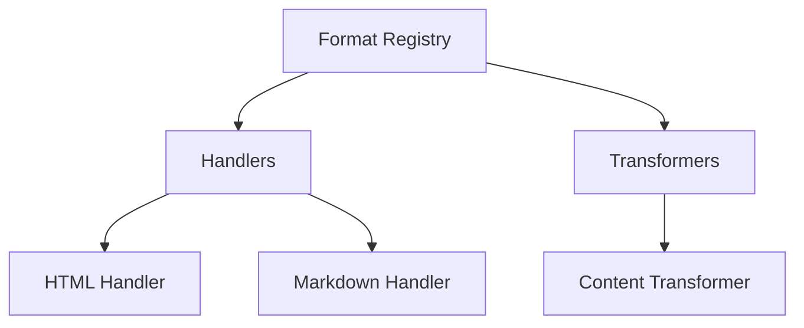

# File Format System Overview

## Architecture
The format system provides a modular architecture for handling different document formats with:
- Core format registry ([`src/main/integration/formats/core/format-registry.ts`](src/main/integration/formats/core/format-registry.ts))
- Content transformers ([`src/main/integration/formats/core/content-transformer.ts`](src/main/integration/formats/core/content-transformer.ts))
- Metadata management ([`src/main/integration/formats/core/metadata-manager.ts`](src/main/integration/formats/core/metadata-manager.ts))

## Component Relationships

## Integration Points
Key integration points:
1. **Analysis Pipeline** - via [`src/main/analysis/pipeline.ts`](src/main/analysis/pipeline.ts)
2. **Security Layer** - via [`src/main/integration/security/content-validator.ts`](src/main/integration/security/content-validator.ts)
3. **Cache System** - via [`src/main/integration/services/cache/format-cache.ts`](src/main/integration/services/cache/format-cache.ts)

## Security Considerations
- Content sanitization before processing
- Format validation against known patterns
- Encryption for sensitive metadata