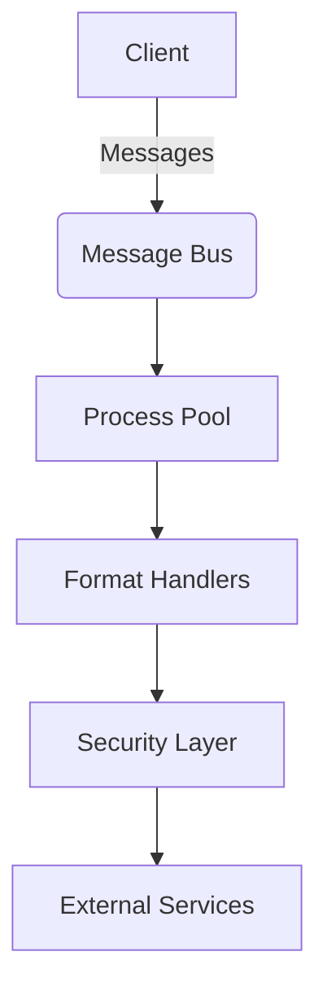

# Integration Core Overview

## Architecture


The integration core provides:
- Process isolation for format handling
- Secure message passing between components
- Resource management for transformation tasks

## Process Model
Key processes:
1. **Main Process**: Manages lifecycle and coordination
2. **Worker Processes**: Handle format transformations
3. **Security Processes**: Validate content and channels

## Message System
Messages use JSON format with schema validation:
```typescript
interface IntegrationMessage {
  id: string;
  type: 'request' | 'response' | 'error';
  payload: unknown;
  metadata: {
    format: string;
    securityToken?: string;
  };
}
```

## Security Boundaries
- Process isolation via Node.js `worker_threads`
- Content validation before processing
- End-to-end encryption for sensitive data

See also: [Security Documentation](../security/validation.md)