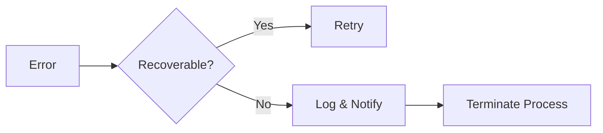

# Process Management

## Lifecycle
1. **Initialization**: 
   - Load configuration
   - Start process pool
   - Register format handlers

2. **Execution**:
   ```typescript
   const result = await processManager.execute({
     format: 'markdown',
     content: '# Sample',
     operations: ['validate', 'transform']
   });
   ```

3. **Shutdown**:
   - Graceful termination of workers
   - Resource cleanup
   - Error recovery

## Resource Management
Key resources:
- Memory limits per process (default: 512MB)
- CPU allocation (weighted priority)
- Concurrent operation limits

## Error Handling


Common error types:
1. **Process Errors**: OOM, crashes
2. **Format Errors**: Invalid content
3. **Security Errors**: Validation failures

See implementation: [`src/main/integration/common/process-manager.ts`](../src/main/integration/common/process-manager.ts)