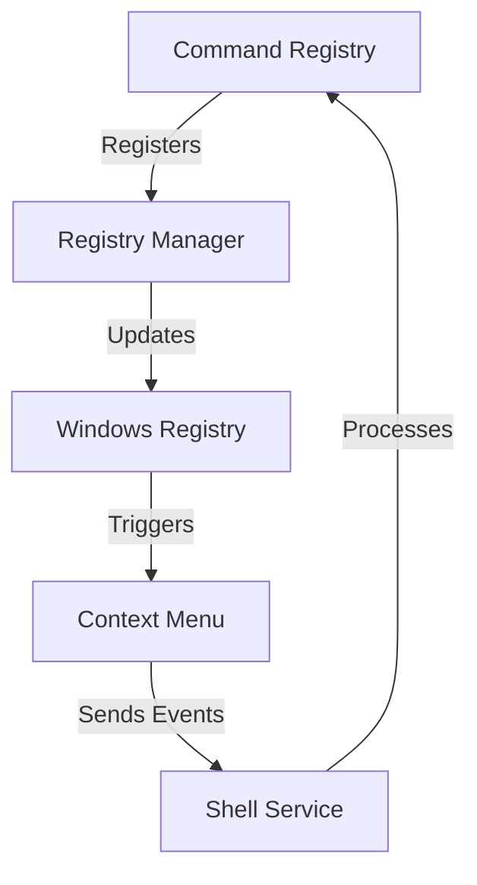

# Shell Integration Overview

## Architecture
The shell integration system provides context menu functionality through these core components:

1. **Command Registry** ([`src/integration/shell/commands/command-registry.ts`](src/integration/shell/commands/command-registry.ts))
   - Maintains all available commands
   - Handles command registration and lookup

2. **Registry Manager** ([`src/integration/shell/registration/registry-manager.ts`](src/integration/shell/registration/registry-manager.ts))
   - Manages Windows Registry operations
   - Handles file type associations

3. **Context Menu Handler** ([`src/integration/shell/registration/context-menu.ts`](src/integration/shell/registration/context-menu.ts))
   - Manages dynamic menu items
   - Handles click events

## Component Relationships

## Security Considerations
- All registry operations are sandboxed
- Commands are validated before execution
- File associations require admin privileges

## Installation Requirements
- Windows 10/11
- .NET Framework 4.8
- Admin privileges for installation