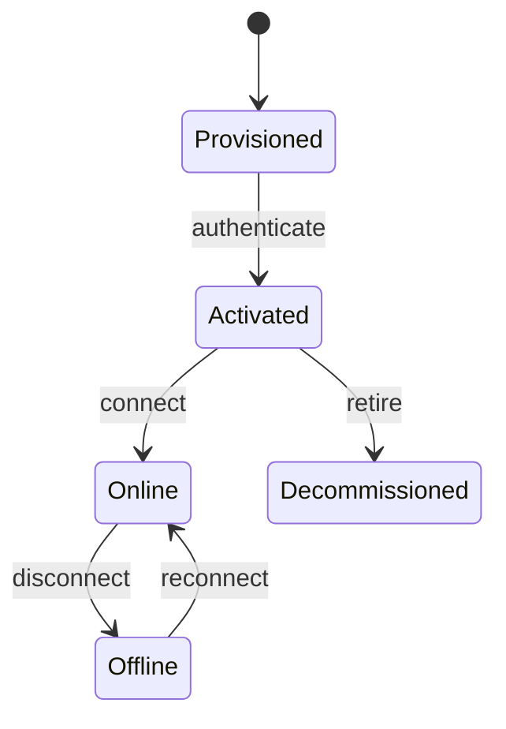

# Device Lifecycle Management

## State Transitions


## Firmware Updates
```typescript
// OTA update handler
async function handleFirmwareUpdate(deviceId: string, version: string) {
  const device = await registry.get(deviceId);
  if (device.status !== 'online') {
    throw new Error('Device offline');
  }

  await broker.publish(`firmware/${deviceId}`, {
    version,
    url: `https://updates.example.com/${version}.bin`
  });
  
  await registry.updateStatus(deviceId, 'updating');
}
```

## Operational Policies
```yaml
# Lifecycle policy example
retentionPolicy:
  inactiveDevices: 
    threshold: 30d
    action: decommission
  firmwareVersions:
    - version: "<2.0.0"
      action: force-update
    - version: "2.0.0 - 2.5.0"
      action: notify
```

[See state machine implementation](src/iot/core/state-manager.ts)