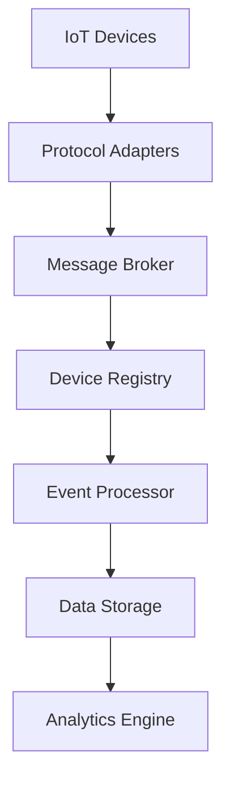

# IoT Core Architecture

## Component Diagram


## Key Components
1. **Protocol Adapters**
   - MQTT/CoAP/HTTP implementations
   - Example MQTT listener:
   ```typescript
   mqttServer.on('message', (topic, payload) => {
     const deviceId = parseDeviceId(topic);
     messageQueue.publish({ deviceId, payload });
   });
   ```

2. **Device Registry**
   - Manages device metadata and credentials
   - Registry interface:
   ```typescript
   interface DeviceRegistry {
     register(device: Device): Promise<Device>;
     updateStatus(deviceId: string, status: DeviceStatus): Promise<void>;
     findByGroup(groupId: string): Promise<Device[]>;
   }
   ```

## Design Principles
1. **Loose Coupling**
   - Components communicate via message queue
   - Example event structure:
   ```json
   {
     "eventId": "uuid",
     "deviceId": "sensor-123",
     "timestamp": "2025-05-10T16:00:00Z",
     "payload": {}
   }
   ```

2. **Scalability**
   - Horizontal scaling of protocol adapters
   - Sharded device registry implementation

[See implementation](src/iot/core/device-registry.ts)