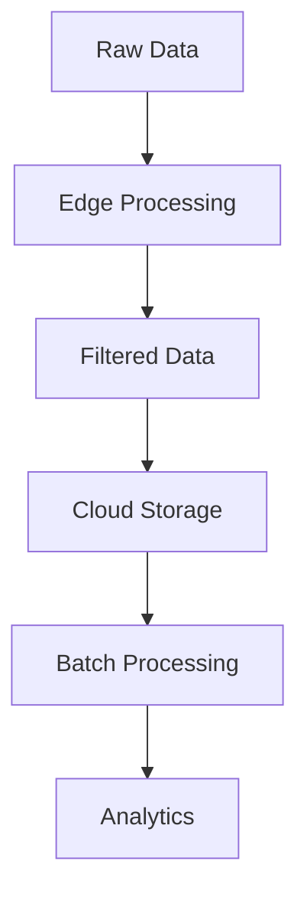

# IoT Device Management Best Practices

## Design Patterns
```typescript
// Observer pattern for device monitoring
class DeviceObserver {
  private observers: ((device: Device) => void)[] = [];

  subscribe(callback: (device: Device) => void) {
    this.observers.push(callback);
  }

  notify(device: Device) {
    this.observers.forEach(observer => observer(device));
  }
}

// Usage
const tempMonitor = new DeviceObserver();
tempMonitor.subscribe(device => {
  if (device.temperature > 80) {
    triggerCoolingSystem(device);
  }
});
```

## Security Guidelines
```yaml
# Security policy template
security:
  deviceAuth:
    method: mutual-TLS
    certRotation: 90d
  dataProtection:
    encryption: AES-256-GCM
    keyManagement: HSM-backed
  accessControl:
    roleBased: true
    defaultPolicy: deny-all
```

## Performance Optimization


## Resource Management
```typescript
// Memory-constrained device example
function processSensorData(data: SensorReading[]) {
  // Process in chunks to avoid OOM
  const CHUNK_SIZE = 100;
  for (let i = 0; i < data.length; i += CHUNK_SIZE) {
    const chunk = data.slice(i, i + CHUNK_SIZE);
    analyzeChunk(chunk);
    gc(); // Explicit garbage collection
  }
}
```

[See optimization strategies](src/iot/utils/performance-optimizer.ts)