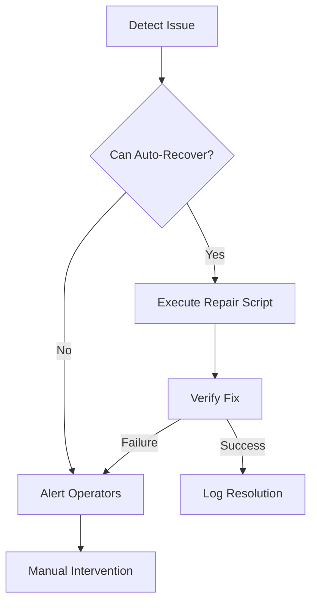

# IoT Device Troubleshooting Guide

## Common Issues
```yaml
# Error code reference
errors:
  CONN-001: "Connection timeout"
  AUTH-003: "Invalid credentials"
  FWUP-007: "Firmware checksum mismatch"
  SENS-012: "Sensor calibration needed"
```

## Debug Procedures
```typescript
// Enable verbose logging
logger.configure({
  level: 'debug',
  transports: [
    new transports.Console({
      format: format.combine(
        format.timestamp(),
        format.json()
      )
    })
  ]
});

// Example debug output
deviceMonitor.on('error', (err) => {
  logger.debug(`Device error: ${err.code}`, {
    deviceId: err.deviceId,
    stack: err.stack
  });
});
```

## Recovery Workflow


## Diagnostic Commands
```bash
# Check device connectivity
curl -v https://api.iot.example.com/health

# Verify firmware integrity
openssl dgst -sha256 firmware.bin
```

[See diagnostics implementation](src/iot/utils/diagnostics.ts)