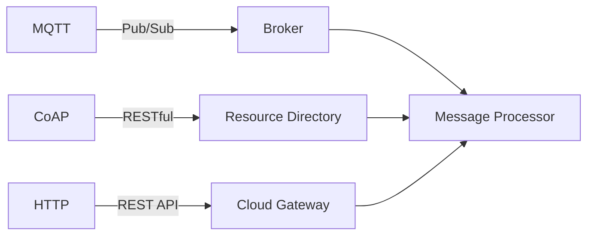

# IoT Protocol Integration Guide

## MQTT Implementation
```typescript
// MQTT client setup
const mqttClient = mqtt.connect('mqtts://iot-broker.com', {
  clientId: 'gateway-01',
  ca: fs.readFileSync('certs/ca.crt'),
  cert: fs.readFileSync('certs/client.crt'),
  key: fs.readFileSync('certs/client.key')
});

mqttClient.subscribe('devices/+/status');
mqttClient.on('message', (topic, message) => {
  const deviceId = topic.split('/')[1];
  statusMonitor.update(deviceId, JSON.parse(message));
});
```

## CoAP Resource Setup
```yaml
# CoAP resource definition
resources:
  /temperature:
    get:
      handler: readTemperature
      observe: true
    post:
      handler: setThreshold
  /firmware:
    post:
      handler: startUpdate
      payloadFormat: octet-stream
```

## Protocol Comparison


[See protocol adapters](src/iot/integration/protocol-adapters.ts)