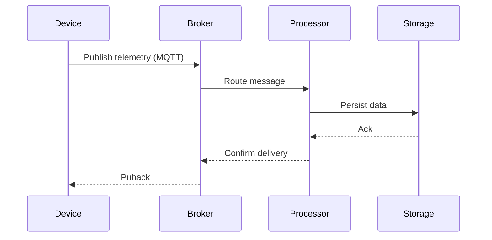

# Device Communication Guide

## Gateway Configuration
```typescript
// MQTT gateway setup
const mqttGateway = new MQTTGateway({
  host: 'mqtt.broker.com',
  port: 8883,
  tls: true,
  topics: ['devices/+/telemetry', 'devices/+/commands']
});

mqttGateway.on('message', (topic, payload) => {
  const [_, deviceId, channel] = topic.split('/');
  eventBus.publish('device-message', { deviceId, channel, payload });
});
```

## Protocol Handling
```yaml
# Protocol configuration
protocols:
  mqtt:
    keepalive: 60
    qos: 1
    retain: true
  coap:
    ackTimeout: 2000
    maxRetransmit: 4
```

## Message Flow


[See gateway implementation](src/iot/services/protocol-gateway.ts)