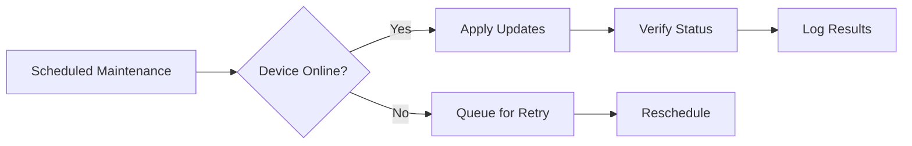

# Device Management Guide

## Configuration Management
```yaml
# Device configuration schema
deviceConfig:
  samplingInterval: 60s
  reportingThresholds:
    temperature: 
      min: -40
      max: 85
    battery:
      critical: 15%
  network:
    retryInterval: 30s
    maxRetries: 5
```

## Monitoring Setup
```typescript
// Monitoring service initialization
const monitor = new DeviceMonitor({
  checkInterval: 300,
  healthChecks: [
    {
      name: 'connection-status',
      check: async (device) => {
        const lastSeen = Date.now() - device.lastActivity;
        return lastSeen < device.config.samplingInterval * 2000;
      }
    }
  ]
});

monitor.on('alert', (deviceId, check) => {
  alertService.trigger(`Device ${deviceId} failed ${check.name}`);
});
```

## Maintenance Procedures


[See monitoring implementation](src/iot/services/device-monitor.ts)