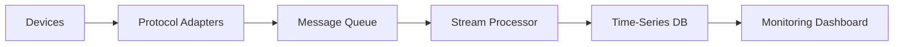

# Device Monitoring Guide

## Telemetry Pipeline


## Alert Configuration
```yaml
alerts:
  highTemperature:
    condition: "temperature > 80"
    severity: critical
    actions:
      - throttleSampling
      - notifyEngineers
  lowBattery:
    condition: "battery < 20%"
    severity: warning  
    actions:
      - enablePowerSaver
```

## Diagnostic Tools
```typescript
// Remote diagnostics example
async function runDiagnostics(deviceId: string) {
  const results = await broker.request(`devices/${deviceId}/diagnostics`, {
    tests: ['memory', 'sensors', 'connectivity']
  });
  
  return {
    deviceId,
    timestamp: new Date(),
    results
  };
}
```

[See monitoring service](src/iot/utils/telemetry-service.ts)